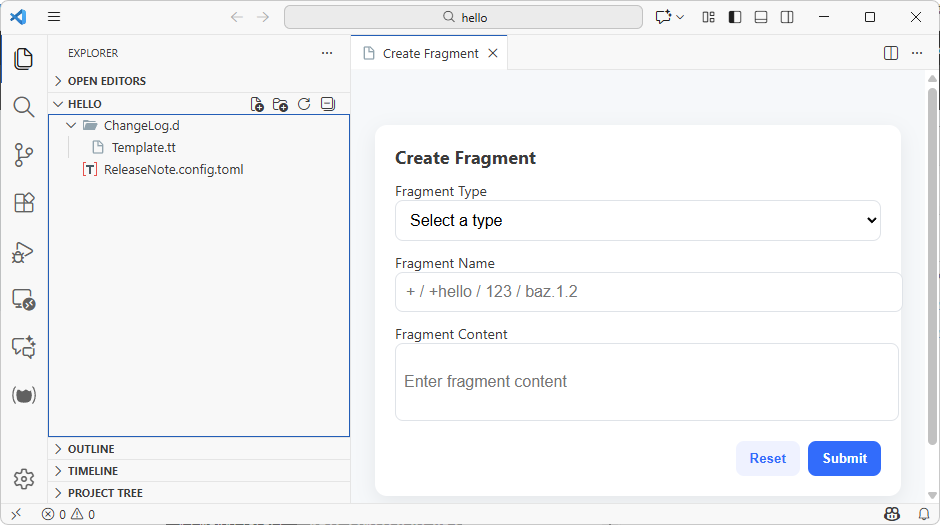
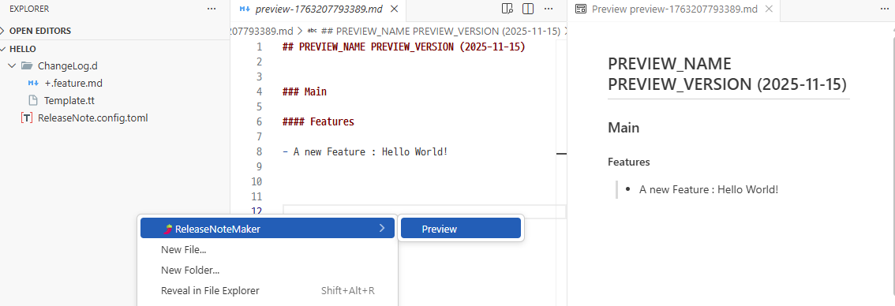
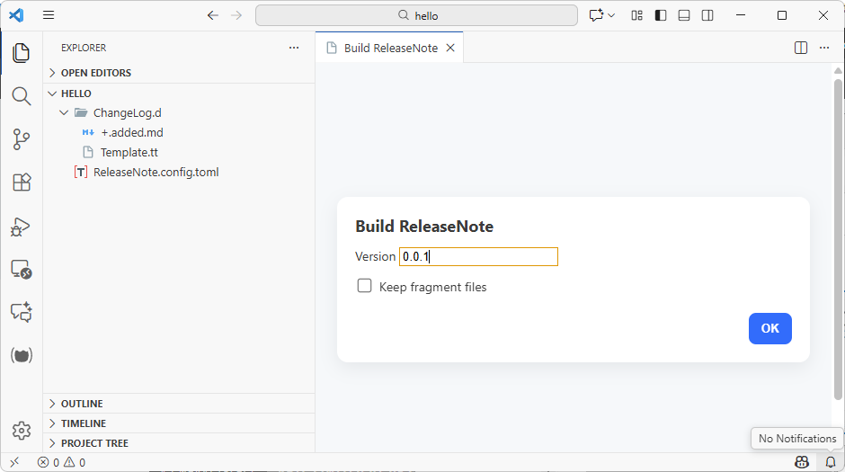

# nf-tools-release-note-maker-vscode

[](https://github.com/netpyoung/nf-tools-release-note-maker-vscode)
[](https://netpyoung.github.io/NF.Tool.ReleaseNoteMaker/)
[](https://github.com/netpyoung/nf-tools-release-note-maker-vscode/blob/main/LICENSE.md)

[](https://marketplace.visualstudio.com/items?itemName=netpyoung.nf-tools-release-note-maker-vscode) [](https://marketplace.visualstudio.com/items?itemName=netpyoung.nf-tools-release-note-maker-vscode)

VSCode extension for [NF.Tools.ReleaseNoteMaker](https://netpyoung.github.io/NF.Tool.ReleaseNoteMaker/)







## Requirements

Need to install dotnet-release-note

``` sh
dotnet tool install --global dotnet-release-note
```
